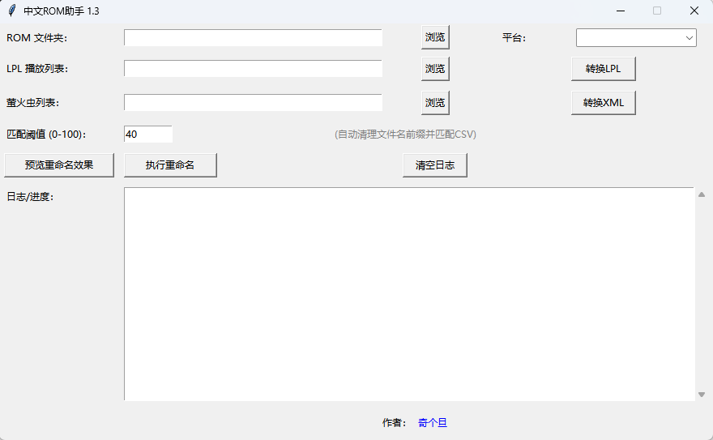

# RetroarchRenameForCN
一个为中文Rom快速在Retroarch模拟器中获取游戏封面的方案

## 功能
- 把不规范中文名用模糊匹配翻译成官方英文名，在retroarch中就可以自动下载封面
- 修改retroarch的lpl列表配置文件，将英文的label修改为标准中文名


## 运行
- 视频教程：https://space.bilibili.com/332938511
- 可以直接从[Releases](https://github.com/busiyg/RetroarchRenameForCN/releases)中下载打包好的exe，也可以自己配置环境运行源码
```bash
pip install rapidfuzz pandas
python ROM_Batch_Renamer.py
```

## 平台
- FC,SFC,GB,GBC,GBA,NDS,3DS,New 3DS,Wii,Wii U,PS1,PSP

## 致谢
https://github.com/yingw/rom-name-cn 项目提供的中文游戏名称数据库。